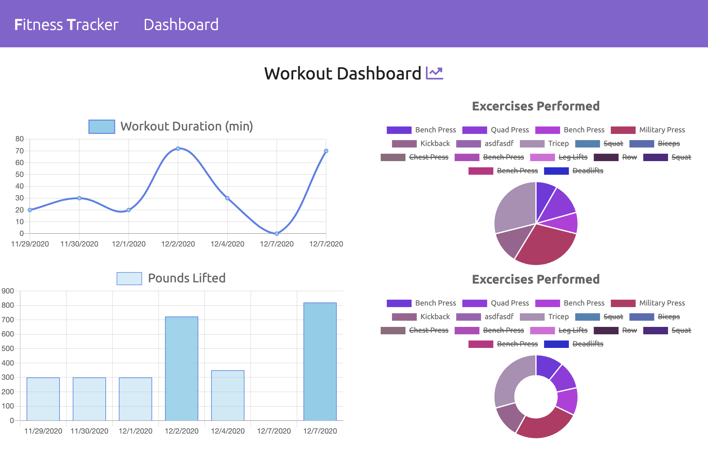
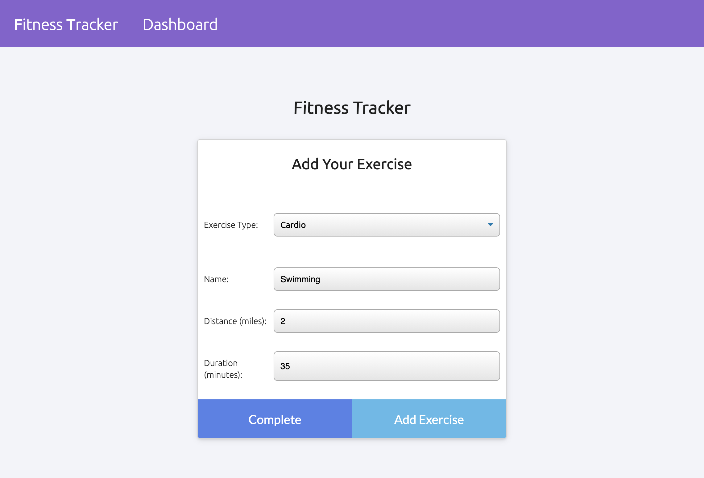

# Workout Tracker

## Deployed Application

[Workout Tracker](https://workout-tracker-mh.herokuapp.com/)

## Description 

This full-stack web application allows users to keep track of workouts consisting of multiple exercises and view exercise statistics.

When the user navigates to the homepage, they are prompted to continue a previous workout (which appears once the user views the page if a previous workout exists) or begin a new workout. The user may then add exercises to this workout and mark as complete. Depending on whether the exercise is selected as cardio or resistance, various fields will appear that let the user enter specific details about each exercise. At any point, the user can navigate to the dashboard page, which will automatically retrieve recent workout data and display charts which display trends regarding workout duration and weight (when applicable).

The application uses MongoDB/Mongoose to store and retrieve user workout/exercise data. If a recent workout does not exist, the user will be notified to create the first workout on the homepage and begin entering exercises. 

## Features

* Node.js back end with Express routing. 
* Front-end written in JavaScript.
* Takes advantage of JavaScript Fetch API.
* MongoDB/Mongoose stores and retrieves saved items. 
* Chart.js library provides tools needed for exercise data charts.
* Incorporates Semantic UI for styling. 

## Credits

Michael Hanson
* michaeledwardhanson@gmail.com
* [GitHub](https://github.com/mhans003)
* [LinkedIn](https://www.linkedin.com/in/michaeledwardhanson/)

## License 

Licensed under the [MIT License](./LICENSE.txt).